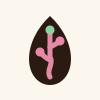

<!-- icono-app.md: propuesta e implementación del icono de aplicación de TONALI (concepto, paleta, variantes y
archivos generados). Se distingue de frontend/src/constants/theme.ts, que guarda los tokens de color de la
interfaz, y de frontend/assets/icon/*.svg, que son los archivos maestros que este documento describe. -->

# Icono de TONALI

## Estado de implementación (09/10/2026)

| Pieza | Archivo | Estado |
|---|---|---|
| SVG maestro, variante principal | [`frontend/assets/icon/icon.svg`](../frontend/assets/icon/icon.svg) | ✅ |
| SVG variante clara | [`frontend/assets/icon/icon-light.svg`](../frontend/assets/icon/icon-light.svg) | ✅ con ajuste de contraste (ver *Paleta*) |
| SVG variante monocromática | [`frontend/assets/icon/icon-mono.svg`](../frontend/assets/icon/icon-mono.svg) | ✅ usa `currentColor` |
| Icono de la app (iOS y Android) | `frontend/assets/images/icon.png`, 1024 px, sin transparencia | ✅ |
| Icono adaptable de Android | `android-icon-foreground.png` + fondo `#2B1A12` + `android-icon-monochrome.png` (icono temático) | ✅ símbolo al 62 % para la zona segura |
| Pantalla de arranque | `splash-icon.png` sobre crema y `splash-icon-dark.png` sobre `#17110E` en modo oscuro | ✅ |
| Favicon web | `favicon.png`, 48 px | ✅ |
| Regenerar los PNG | `python frontend/scripts/render_icons.py` (Chrome + Pillow) | ✅ |
| Probarlo en un celular real (iOS, Android, recorte circular) | — | ⏳ |
| Comparar la paleta con el empaque final | — | ⏳ |

Se quitaron los iconos de la plantilla de Expo (`assets/expo.icon` y el fondo adaptable). iOS usa el icono
general de `app.json`.

| Principal | Clara | Monocromática |
|:---:|:---:|:---:|
|  |  |  |

**Verificado:** la hoja de prueba que genera el script muestra el icono a 16, 24, 32, 48 y 128 px sobre
fondo claro y oscuro, en escala de grises y con la máscara circular de Android. Se lee bien desde 24 px; a
16 px queda la silueta de la semilla, que es lo esperado. El camino sigue visible en escala de grises.
`expo-doctor` pasa 21/21 y el build web genera el favicon.

## Concepto

**Una semilla de amaranto que se convierte en camino.**

El icono representa el origen local y el recorrido que documenta TONALI. Su forma principal combina una
semilla ovalada de amaranto con una línea continua que nace en la base y se ramifica en tres puntos. Los
puntos aluden a los pasos del registro —productor, acopiador y TONALI— y la línea expresa continuidad desde
el cultivo hasta el lote.

La imagen comunica producto, origen y trazabilidad sin usar una cadena de bloques, un código QR, una hoja
genérica ni un mapa. El icono no sugiere que cada lote ya está publicado o verificado en Stellar: el MVP
actual usa firmas simuladas.

## Composición

- **Contenedor:** cuadrado a sangre; cada plataforma aplica su propio recorte.
- **Fondo:** cacao oscuro uniforme.
- **Símbolo central:** una semilla vertical estilizada en color crema.
- **Interior de la semilla:** una línea ascendente en amaranto, con una curva leve como un sendero, que se
  ramifica hacia dos nodos (uno a cada lado, a distinta altura) y sube hasta un tercero.
- **Acento:** el nodo superior es verde hoja, para sugerir crecimiento. Es el único elemento verde.
- **Nombre:** no se incluye “TONALI” dentro del icono; el texto pierde legibilidad en tamaños pequeños.
- **Balance:** símbolo centrado ópticamente, con espacio libre amplio y sin detalles finos.

### Construcción (`viewBox="0 0 100 100"`)

| Forma | Definición |
|---|---|
| Fondo | Rectángulo 100 × 100 |
| Semilla | Una sola curva cerrada: punta en (50, 16), base redondeada en y = 85, ancho máximo de 42 |
| Camino | Trazos de 5 unidades (12 % del ancho de la semilla), extremos y uniones redondeados |
| Nodos | Tres círculos de radio 4.5, del mismo tamaño: (40, 52), (60, 41) y el superior en (50, 30) |

Son cuatro formas principales —fondo, silueta, camino y acento—, sin filtros, sombras, gradientes,
tipografía ni imágenes externas. Los nodos están a distinta altura para leerse como una ruta y no como una
gráfica financiera.

## Paleta

La paleta parte de los colores del front (`theme.ts`). **Es una propuesta visual del equipo, no una
confirmación de que coincida con el empaque final de TONALI** (ver `docs/verificacion.md`).

| Color | HEX | Función en el icono | Uso |
|---|---|---|---|
| Cacao profundo | `#2B1A12` | Fondo (principal) · semilla (clara) | Base |
| Crema cálida | `#FBF6EE` | Semilla (principal) · fondo (clara) | Contraste alto sobre cacao |
| Amaranto | `#8C1D40` | Camino y nodos (principal) | Acento de marca y trazabilidad |
| Verde campo | `#2F6B3B` | Nodo superior (principal) | Único detalle secundario |
| Amaranto claro | `#E58AA6` | Camino y nodos (clara) | Mantiene contraste sobre la semilla cacao |
| Verde claro | `#8FD19E` | Nodo superior (clara) | Mantiene contraste sobre la semilla cacao |
| Cacao suave | `#6E5A4E` | Variante monocromática | Usos de bajo contraste decorativo |
| Crema rosada | `#F6E3EA` | Fondo alternativo claro | Material de marca o web |

**Ajuste respecto a la propuesta original:** la variante clara pedía el camino en amaranto `#8C1D40` sobre
la semilla cacao; ese par tiene muy poco contraste. Se usan las versiones claras de amaranto y verde, que ya
existen como tokens del modo oscuro en `theme.ts`.

Cacao y crema forman la base, amaranto define el gesto visual y el verde queda limitado a un punto.

## Variantes

- **Principal:** fondo cacao, semilla crema, camino amaranto, nodo superior verde. Es el icono de la app.
- **Clara:** fondo crema, semilla cacao, camino amaranto claro. Para presentaciones, fondos claros y la
  pantalla de arranque en modo claro.
- **Monocromática:** la semilla con el camino recortado, en un solo color (`currentColor`). En blanco es la
  capa del icono temático de Android.
- **Símbolo sin contenedor:** la semilla y el camino sin fondo; es lo que usa la pantalla de arranque. No
  usarlo como icono de aplicación sin comprobar el contraste con el fondo.

## Legibilidad y accesibilidad

- Probado a 16, 24, 32, 48 y 128 px; en 16 px la semilla se reconoce y el camino se simplifica solo.
- Trazos de 12 % del ancho del símbolo, por encima del mínimo de 8 %.
- Contraste fuerte entre fondo y silueta; la forma sigue siendo reconocible en escala de grises.
- El verde no transmite ningún estado: es decorativo.
- En el icono adaptable de Android el símbolo ocupa el 62 % del lienzo para no tocar el recorte circular.
- ⏳ Falta revisar en dispositivos reales el recorte de iOS, Android y el favicon en pestañas.

## Personalidad de marca

- **Cálido:** por la base cacao y crema.
- **Local:** por la referencia botánica al amaranto.
- **Confiable:** por la ruta continua y sus tres pasos.
- **Claro:** por una forma central simple, sin ornamentación tecnológica.
- **Honesto:** sin sellos de “verificado” que el prototipo aún no puede respaldar.

## No usar

- Cubos, cadenas o nodos conectados con apariencia de blockchain.
- Un QR como elemento principal.
- Un escudo o sello que prometa certificación.
- Una planta genérica con muchas hojas o detalles.
- Texto diminuto o el lema dentro del icono.
- La paleta propuesta como definitiva antes de validar el empaque.

## Descripción corta para diseño

> Icono cuadrado para TONALI. Fondo cacao profundo `#2B1A12`, una semilla vertical de amaranto en crema
> `#FBF6EE` y, dentro, un camino ascendente amaranto `#8C1D40` con tres nodos redondos del mismo tamaño; el
> superior en verde `#2F6B3B`. Formas planas y trazos gruesos para que funcione a 16 px. La semilla comunica
> el origen; el camino y los tres nodos, el recorrido productor → acopiador → TONALI. Sin texto, QR, cadena
> de bloques ni símbolos de certificación. La paleta es propuesta y debe compararse con el empaque final.

## Pendiente antes de adoptarlo

1. Comparar cacao, amaranto y verde con los colores reales del empaque.
2. Revisar con el equipo que la referencia botánica coincida con la identidad visual deseada.
3. Probar el icono en iOS, Android (incluido el icono temático) y web con Expo Go o una build de desarrollo.
4. Confirmar que el símbolo no se confunda con una certificación de origen o una verificación activa en Stellar.
