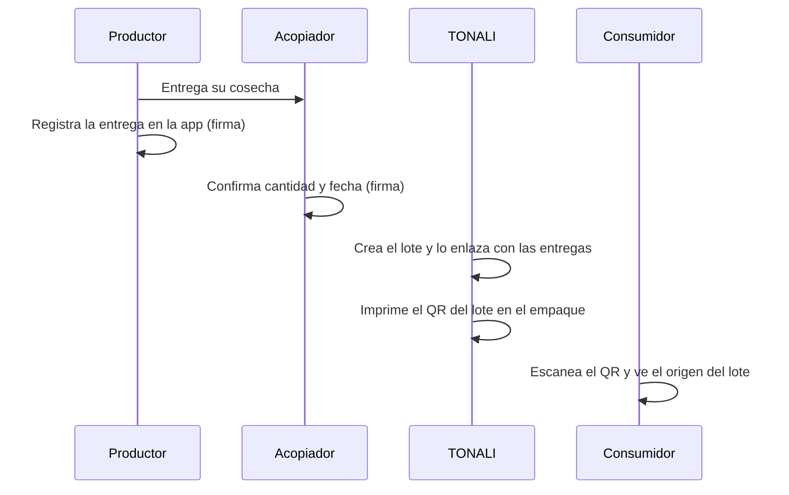
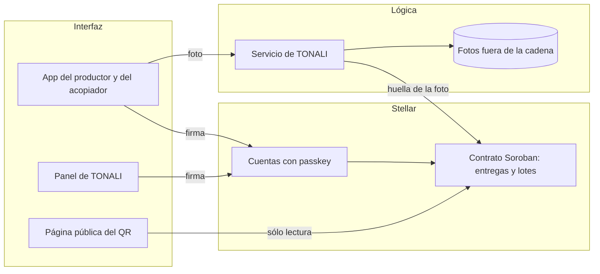

<!-- ProductBlueprint.md: entregable grupal (Fase 2, semana 2): blueprint del producto TONALI.
No confundir con las historias individuales (Luis_Cardenas.md y las de cada integrante): son la Fase 1. -->
# Product Blueprint

**Nombre del proyecto:** TONALI

**Repositorio (enlace obligatorio):** [LuisAlejandroCR/tonali](https://github.com/LuisAlejandroCR/tonali)

---

## Contenido

1. Priorización de historias
2. Propuesta de valor
3. Flujo de usuario
4. Alcance del MVP
5. Lean Canvas
6. Backlog priorizado (Kanban)
7. Arquitectura inicial
8. Uso de Stellar y justificación

---

## 1. Priorización de historias

**Criterio de priorización:** MoSCoW aplicado a la hipótesis del Problem Brief. *Imprescindible* es lo
que hace falta para que un consumidor compruebe el origen de una barra real: registrar en el origen,
enlazar el lote y consultarlo. *Debería* es lo que suma confianza pero no bloquea el recorrido.
*Podría* es valor de segundo orden.

| Prioridad | Historia | Propuesta por | Por qué entra al backlog |
| :---: | --- | :---: | --- |
| 1 | Como pequeño productor quiero registrar cada entrega desde mi celular en pocos pasos para tener una prueba de que esa cosecha es mía y saber a dónde llegó. | Luis Cardenas | Imprescindible: ataca la causa raíz (fricción 1). |
| 2 | Como TONALI quiero crear un lote de barras y enlazarlo con las entregas de insumo que usé para que cada empaque lleve una historia de origen revisable. | Luis Cardenas | Imprescindible: sin este enlace el QR no muestra nada. |
| 3 | Como consumidor quiero escanear el QR del empaque y ver qué productores y qué entregas componen mi barra para comprobar el origen. | Luis Cardenas y Gisell Arroyo | Imprescindible: es el cambio que vive el usuario principal. Los dos la propusimos por separado. |
| 4 | Como acopiador quiero confirmar la recepción de una entrega para que quede una constancia que ven todas las partes. | Luis Cardenas | Debería: segunda firma independiente en el punto donde se pierde el rastro. |
| 5 | Como consumidor quiero consultar la fecha de elaboración y el lote de mi producto para identificarlo si necesito hacer una aclaración. | Gisell Arroyo | Debería: son dos datos más en la misma página del QR y casi no cuestan. |
| 6 | Como verificador de campo quiero adjuntar una visita con foto y fecha a una entrega para respaldar que el dato corresponde al mundo físico. | Luis Cardenas | Debería: responde al supuesto 3 (el “oráculo”). |
| 7 | Como productor local quiero recibir una notificación cuando mi entrega sea aceptada para saber que se recibió correctamente. | Gisell Arroyo | Podría: el aviso sale de la confirmación del acopiador (historia 4). Sube la adopción del productor (supuesto 2), pero el recorrido funciona sin él. |

**Quedan fuera por ahora:** la revisión de calidad por lote, el inventario de insumo por productor, la
consulta del distribuidor y los reportes (Gisell Arroyo), y el historial de correcciones y el panel del
productor (Luis Cardenas). Son operación interna o valor de segundo orden: no ponen a prueba la
hipótesis. El inventario y los reportes saldrán casi solos de los mismos registros cuando existan.

---

## 2. Propuesta de valor

**Usuario (del Problem Brief):** el consumidor de 18 a 35 años que paga un sobreprecio por una barra con
identidad morelense. Usuario secundario: el pequeño productor de amaranto, cacahuate o miel.

**Resultado que obtiene:** al escanear el QR del empaque, el consumidor ve qué productores entregaron los
insumos de *ese* lote, cuándo, quién confirmó la recepción y si alguien verificó la entrega en campo. El
productor obtiene una prueba de que su cosecha terminó en una marca que presume su origen.

**Por qué elegiría esta solución:** porque deja de depender de la palabra de la marca. Los registros los
firman quienes participaron en cada paso, y ni TONALI ni el acopiador pueden reescribirlos después.
Consultar no pide cuenta, billetera ni aplicación: basta con la cámara del celular.

**En qué se diferencia de cómo lo resuelve hoy:** hoy el consumidor sólo tiene la etiqueta, que la
NOM-051 no obliga a detallar por procedencia, y las fotos en redes, que no prueban nada. La alternativa
formal, una certificación de origen, es una auditoría externa con un costo fijo que un lote de unas 100
barras no absorbe. TONALI ofrece una prueba por lote, firmada por varias partes, que un imitador no puede
copiar con sólo copiar el discurso.

---

## 3. Flujo de usuario

| Paso | Rol | Qué hace | Punto de interacción |
| :---: | :---: | --- | --- |
| 1 | Productor | Entrega su cosecha y registra la entrega: insumo, cantidad, fecha y una foto. La app le crea una cuenta sin pedirle que entienda de cripto. | App web en el celular · firma con passkey · red Stellar |
| 2 | Acopiador | Recibe la entrega y confirma cantidad y fecha. Si no coincide, la rechaza con un motivo. | App web · firma · red Stellar |
| 3 | TONALI | Al producir, crea un lote y selecciona las entregas confirmadas que usó. | Panel de la marca · firma · red Stellar |
| 4 | TONALI | Genera el QR del lote y lo imprime en el empaque. | Panel de la marca |
| 5 | Consumidor | Escanea el QR en la tienda, el gimnasio o la cafetería. | Cámara del celular · página pública |
| 6 | Consumidor | Ve la lista de productores y entregas del lote, con fecha, firmas y enlace al registro en la red. | Página pública · lectura de la red Stellar |

El consumidor nunca firma ni necesita billetera: sólo lee. Las escrituras las hacen quienes conocen el
hecho (el productor, el acopiador y la marca), cada uno con su propia cuenta, para que ninguna parte
controle sola la historia del lote.

---

## 4. Alcance del MVP

| Dentro del MVP (funcionalidad central) | Fuera del MVP (deseable, para después) |
| --- | --- |
| Registro de entrega firmado por el productor (historia 1). | Pago directo al productor en la red o sobreprecio compartido. |
| Confirmación de la entrega por el acopiador (historia 4). | Verificación de campo con validadores externos (historia 6): en el piloto la hace el equipo. |
| Creación de lote enlazado con entregas (historia 2). | Panel del productor con los lotes donde terminó su cosecha. |
| Página pública del QR, sin cuenta ni billetera, con fecha de elaboración y número de lote (historias 3 y 5). | Historial visible de correcciones (hoy sólo se agregan registros, no se editan). |
| Red de prueba de Stellar (testnet) con un solo insumo: amaranto. | Varios insumos, varias marcas y red principal (mainnet). |
| | Aviso al productor cuando aceptan su entrega (historia 7). |

**Por qué el recorte sigue entregando valor:** el MVP recorre la cadena completa, del productor al
consumidor, para un insumo y un lote real. Eso basta para validar los dos supuestos que pueden tumbar la
hipótesis: si al consumidor le importa comprobar el origen (supuesto 1) y si el productor y el acopiador
aceptan registrar cada entrega (supuesto 2). El pago directo y los validadores externos sólo tienen
sentido si esos dos supuestos se sostienen, así que construirlos antes sería gastar en una respuesta que
todavía no conocemos. Limitarnos al amaranto reduce la carga operativa del piloto sin cambiar el flujo:
agregar cacahuate o miel es repetir el mismo registro.

---

## 5. Lean Canvas

**Enlace al Lean Canvas (obligatorio):** [Lean Canvas de TONALI](https://github.com/LuisAlejandroCR/tonali/blob/main/docs/semana2/ProductBlueprint.md#5-lean-canvas)
(el lienzo vive en este mismo documento, para no depender de una herramienta externa).

| Bloque | Contenido |
| --- | --- |
| **Problema** | 1) El origen del insumo se pierde en la mezcla del acopiador. 2) La etiqueta es la única fuente de verdad. 3) Certificar es caro para lotes pequeños. |
| **Segmento de usuarios** | Consumidor de 18 a 35 años que paga más por identidad local · pequeño productor de amaranto, cacahuate o miel en Morelos. *Early adopters:* compradores de TONALI en gimnasios y cafeterías. |
| **Propuesta de valor única** | “Escanea tu barra y comprueba quién cultivó lo que comes.” Origen firmado por quienes participaron, no sólo contado por la marca. |
| **Solución** | Registro de entrega firmado en el origen · confirmación del acopiador · lote enlazado a sus entregas · QR público. |
| **Canales** | El propio empaque (QR) · puntos de venta de TONALI · redes sociales de la marca · contacto directo con productores. |
| **Métricas clave** | % de entregas registradas en el origen · % de lotes con QR completo · escaneos por lote vendido · productores activos. |
| **Ventaja diferencial** | Un imitador puede copiar el discurso, pero no un historial firmado por productores reales y fechado desde el primer lote. |
| **Estructura de costos** | Desarrollo de la app · comisiones de la red · capacitación a productores · verificación de campo. Margen de referencia: $20 de precio menos $8.96 de costo deja $11.04 MXN por barra (supuestos del equipo, Problem Brief). En testnet la red no tiene costo real. El costo por lote se medirá en el piloto, antes de pasar a mainnet. |
| **Flujos de ingreso** | Venta de la barra a $20 MXN (supuesto del equipo): el sobreprecio de lo local ahora es comprobable. Hipótesis a futuro, fuera del MVP: ofrecer el registro a otras marcas artesanales. |

---

## 6. Backlog priorizado (Kanban)

**Enlace al tablero (obligatorio):** [TONALI · Backlog en GitHub Projects](https://github.com/users/LuisAlejandroCR/projects/2)

Cada tarjeta es una historia de la sección 1, con su prioridad (MoSCoW), su alcance (MVP o después) y sus
criterios de aceptación.

---

## 7. Arquitectura inicial

| Capa | Componente | Qué hace |
| :---: | --- | --- |
| Interfaz | App web para celular (productor y acopiador), panel de la marca y página pública del QR | Captura entregas, confirmaciones y lotes. La página del QR muestra el origen sin pedir cuenta. |
| Lógica | Servicio de TONALI | Prepara las transacciones que cada parte firma, guarda las fotos fuera de la cadena y genera el QR de cada lote. |
| Stellar | Cuentas por actor y contrato inteligente Soroban | Guarda entregas, confirmaciones y lotes, cada registro firmado por quien lo hizo y sin posibilidad de editarse. |

**En qué punto entra la red:** en cada **escritura** (el productor registra, el acopiador confirma, la
marca crea el lote) y en la **lectura pública** del QR. La firma ocurre en el dispositivo de cada
persona. El servicio de TONALI prepara la transacción, pero no puede firmar en nombre del productor ni
del acopiador: por eso la marca deja de ser juez y parte. Las fotos y los datos personales no suben a
la red. En la cadena sólo queda la huella (*hash*) de la foto, que permite comprobar que no se cambió,
y un identificador del productor, no su nombre completo.

---

## 8. Uso de Stellar y justificación

**Criterio de pertinencia (del Problem Brief):** varias partes que no confían entre sí necesitan
compartir un mismo registro, y ese histórico no puede alterarse. Como criterio parcial, se reduce el
peso de la certificadora.

| Componente de Stellar | Para qué lo usamos | Por qué ese y no otra alternativa |
| --- | --- | --- |
| **Cuentas de Stellar**, una por actor | Identificar quién firma cada registro: productor, acopiador y marca. | Si la marca controlara las cuentas en su base de datos, volvería a ser la única fuente de verdad. |
| **Contratos inteligentes Soroban** | Guardar entregas, confirmaciones y lotes con reglas fijas. Por ejemplo: un lote sólo puede enlazar entregas confirmadas, y un registro no se edita, sólo se agrega. | Una base de datos propia deja que la marca edite o borre. En el contrato, las reglas quedan públicas y nadie puede cambiarlas para un lote en particular. |
| **Passkeys** (billeteras con la huella o el rostro del celular) | Que el productor firme sin frases semilla ni extensiones del navegador. | El supuesto 2 depende de que registrar sea fácil. Una billetera tradicional sería una barrera para un productor sin experiencia en cripto. |
| **Testnet** (red de prueba) | Correr el piloto sin costo real. | Permite validar los supuestos antes de pagar comisiones en la red principal. |

Fuera del MVP: pagos en *stablecoin* sobre Stellar para pagarle directo al productor, cuando el
supuesto 2 esté validado.

Soporte de passkeys confirmado: el Protocol 21 de Stellar agregó a Soroban la verificación de firmas
secp256r1, la curva que usan las passkeys ([CAP-0051](https://github.com/stellar/stellar-protocol/blob/master/core/cap-0051.md),
estado *Final*; consultado el 05/10/2026).
