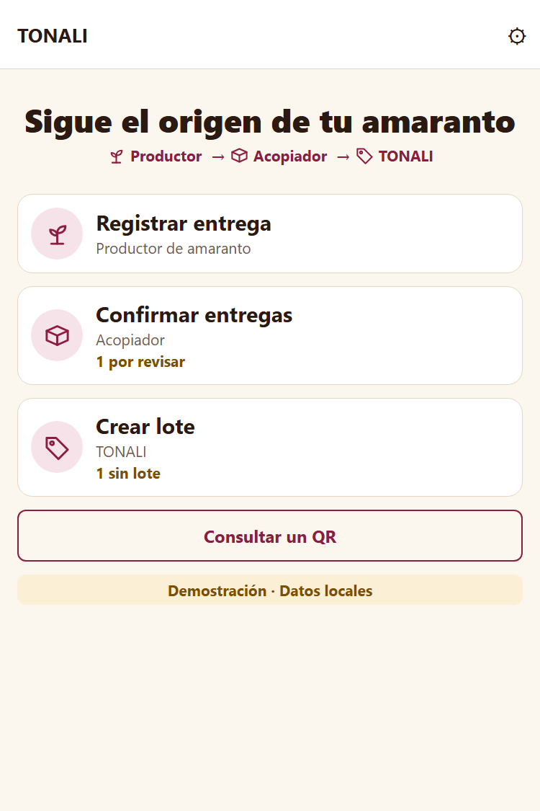
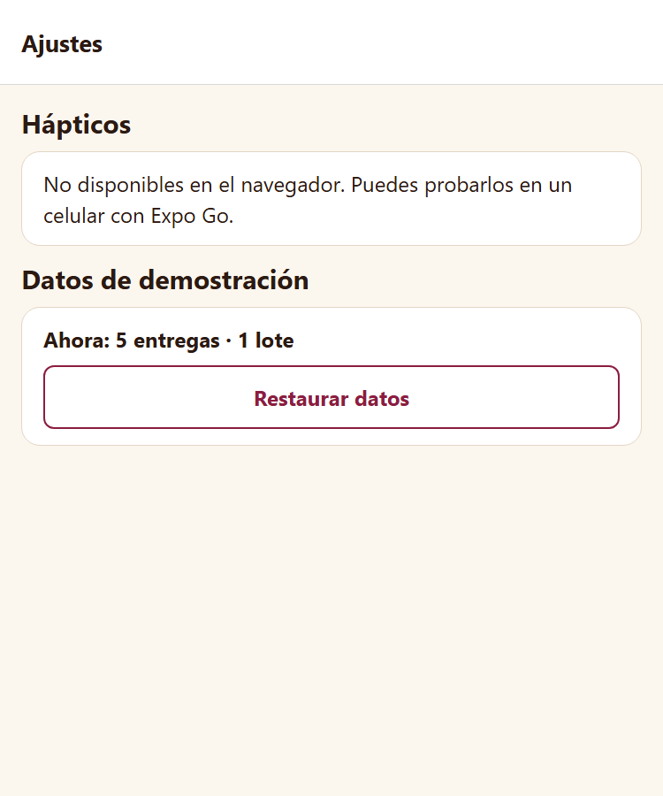
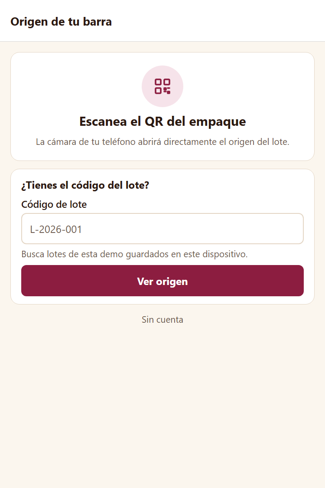
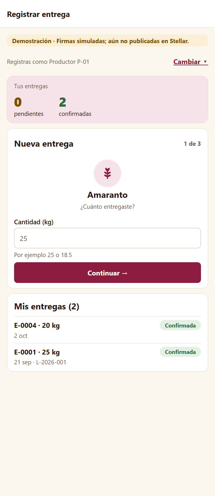
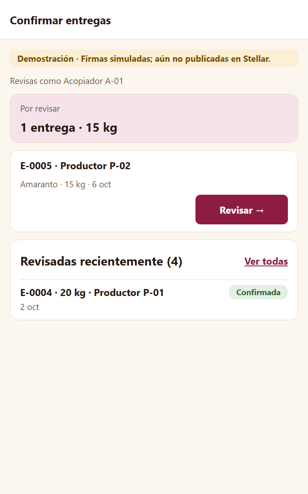
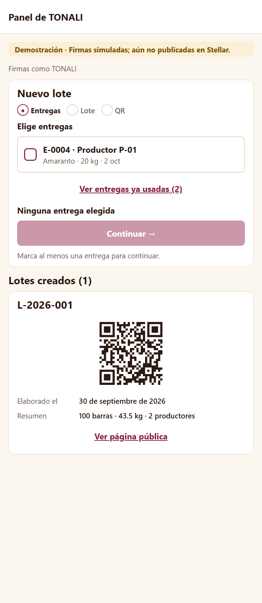
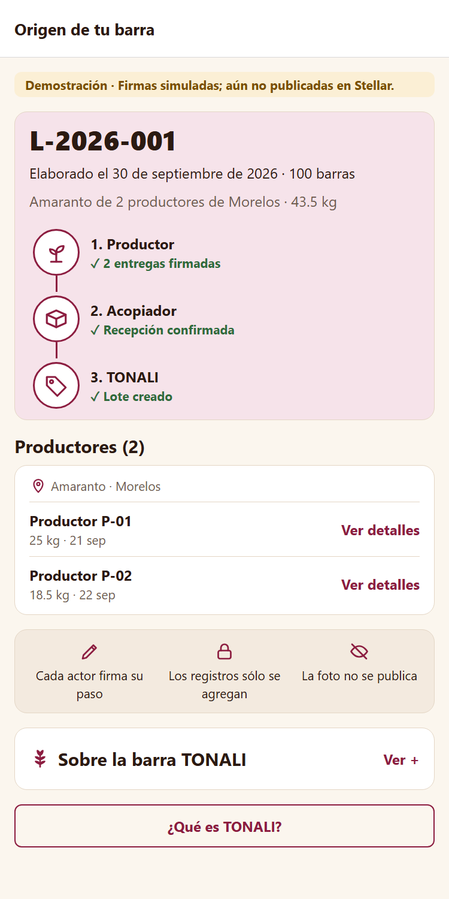

<!-- Documentacion.md: entregable grupal de la semana 3 (Functional Proof): front construido,
decisión técnica de contratos, participación y siguiente paso. No confundir con README.md,
que sólo dice cómo instalar y correr el proyecto, ni con docs/memoria.md (bitácora interna). -->
# Functional Proof — TONALI

## 1. Front construido

El front vive en [`frontend/`](../../frontend) y está hecho con **Expo (React Native) y TypeScript**.
Elegimos Expo porque TONALI terminará como app móvil para el productor y el acopiador, y la misma base
de código se exporta a web: el jurado puede verla en el navegador y la página pública del QR sigue siendo
una dirección que cualquiera abre sin instalar nada. Se ejecuta con los comandos del `README.md`.

Las pantallas recorren el flujo principal del MVP definido en el Product Blueprint (sección 3, *Flujo de
usuario*, y sección 4, *Alcance del MVP*): **registrar la entrega → confirmarla → crear el lote con su QR →
consultar el origen**. Cada pantalla corresponde a un paso y a una historia priorizada.

| Pantalla | Ruta | Paso del flujo | Historia del Blueprint |
| --- | --- | :---: | --- |
| Inicio | `/` | — | Elige un flujo de demostración o abre la consulta del consumidor. |
| Ajustes | `/ajustes` | — | Sólo lo que existe: hápticos al guardar y restaurar los datos de demostración. |
| Consultar | `/consultar` | 5 | Entrada del consumidor sin el empaque: explica el QR y acepta un código de lote. |
| Registrar entrega | `/productor` | 1 | Historia 1: el productor registra su entrega desde el celular. |
| Confirmar entregas | `/acopiador` | 2 | Historia 4: el acopiador confirma o rechaza la recepción. |
| Panel de TONALI | `/marca` | 3 y 4 | Historia 2: la marca crea el lote enlazado a sus entregas y genera el QR. |
| Origen de tu barra | `/lote/<número>` | 5 y 6 | Historias 3 y 5: el consumidor ve productores, entregas, fecha de elaboración y lote. |

Las cuatro pantallas siguen el mismo patrón: **resumen → acción principal → resultado o historial**, y
las cuatro operativas llevan la misma banda: “Demostración · Firmas simuladas; aún no publicadas en Stellar.”
Cada una cuenta la tarea de su rol: el productor “registré esta entrega; ahora espera revisión”, el
acopiador “estas entregas esperan mi confirmación”, TONALI “estas entregas forman este lote; aquí está su
QR” y el consumidor “este lote recorrió estos pasos”.

### Inicio, ajustes y consulta

- **Inicio:** “Sigue el origen de tu amaranto” y el recorrido con iconos Productor → Acopiador → TONALI.
  Tres tarjetas para elegir un flujo de demostración —Registrar entrega, Confirmar entregas, Crear lote—,
  con lo pendiente en su propia línea bajo el rol (“1 por revisar”), y el botón “Consultar un QR”. En
  pantallas estrechas el recorrido se apila en vertical.
  Abajo, la banda “Demostración · Datos locales”.
- **Sin login ni perfil:** los roles de prueba se eligen aquí y el consumidor entra por el QR sin cuenta.
  Pantallas de cuenta prometerían funciones que la demo todavía no tiene; tendrán sentido cuando existan
  cuentas reales con passkey y permisos por actor.
- **Ajustes (⚙ en el encabezado):** sólo los controles que existen: hápticos al guardar (en el celular) y
  restaurar los datos de demostración (“Ahora: 5 entregas · 1 lote”), con un aviso “¿Restaurar los
  datos?” antes de reemplazarlos y la confirmación “✓ Datos de demostración restaurados”. Al restaurar,
  Inicio, Productor, Acopiador y TONALI vuelven a su estado inicial aunque sigan abiertas detrás. En el navegador
  explica que los hápticos sólo se prueban en el celular.

- **Consultar:** “Escanea el QR del empaque” explica que la cámara del teléfono abre el origen directo, y
  “¿Tienes el código del lote?” lo abre con el código impreso. Aclara que busca lotes de esta demo
  guardados en el dispositivo; si no existe, lo dice ahí mismo sin cambiar de pantalla, y el aviso se
  borra en cuanto se edita el código. No pide cuenta.

### Registrar entrega (productor)

- **Resumen:** cifras grandes con etiqueta: pendientes, confirmadas y, si hay, rechazadas. La cuenta
  simulada se cambia con un selector ligero (“Cambiar ▾” abre una lista de opciones), sin pantalla de perfil.
- **Acción en tres pasos cortos** (“1 de 3”), cada uno con su icono: ① amaranto y cantidad en kilos,
  ② fecha, con atajos “Hoy” y “Ayer”, ③ foto opcional y “Registrar ✓”. Cada paso valida lo suyo antes de
  avanzar (cantidad en cero o con texto, fecha mal escrita o futura) y la flecha “←” vuelve al paso anterior. **La foto no
  sale del teléfono:** la app calcula su huella SHA-256 en el dispositivo y sólo esa huella entra al
  registro (sección 7 del Blueprint).
- **Resultado:** una tarjeta breve con un check animado: “Entrega registrada · E-000X · N kg. Ahora espera
  la revisión del acopiador”, y “Registrar otra”. El historial confirma lo mismo con menos énfasis.
- **Historial:** “Mis entregas” en filas compactas con su estado, el motivo si la rechazaron y el lote donde
  terminó: la prueba de “a dónde llegó mi cosecha” (historia 1).

### Confirmar entregas (acopiador)

- **Resumen:** “Por revisar: N entregas · X kg”, que se actualiza al confirmar o rechazar.
- **Subpantallas:** lista de pendientes con “Revisar →” · revisión de una entrega (“← Entregas · 1 de N”) ·
  resultado con “Siguiente entrega” y “Volver a pendientes” · historial con filtros (Todas, Confirmadas,
  Rechazadas).
- **Revisión de una entrega:** productor, amaranto y kilos, fecha y región. El botón
  principal es **✓ Confirmar recepción**; “Rechazar · indicar motivo” es secundario y abre “Rechazar
  E-000X” con la misma entrega a la vista. Hay que elegir qué no coincide —Cantidad, Fecha, Producto u
  Otro—; el detalle es opcional, salvo con “Otro”. El motivo queda escrito para el productor.
- **Resultado:** “✓ Recepción confirmada” con check animado. El rechazo usa un aviso neutro, sin
  celebración ni vibración.
- **Historial:** “Revisadas recientemente” muestra la última y “Ver todas” abre el historial con filtros. Es la
  segunda firma independiente del Blueprint; una entrega revisada no vuelve a revisarse ni se edita.

### Panel de TONALI (marca)

- **Tres etapas visibles:** Entregas → Lote → QR. La actual lleva ●, las hechas ✓ y las que siguen ○;
  es un indicador de avance, no navegación.
- **① Entregas:** cada entrega confirmada sin lote es una fila con casilla visible y estado marcado claro;
  las que ya están en otro lote se consultan en la subpantalla “Entregas ya usadas”, de sólo lectura. El total se actualiza al marcar
  (“2 elegidas · 45 kg · 1 productor”) y “Continuar” sólo se activa con al menos una.
- **② Lote:** fecha de elaboración y número de barras, con el total a la vista (“2 entregas · 45 kg ·
  1 productor · 100 barras”). El lote no puede ser
  anterior a sus entregas: las reglas que hará cumplir el contrato.
- **③ QR:** el indicador queda en ✓ ✓ ● y el lote creado es protagonista: check animado, número, QR listo para imprimir, resumen y “Ver
  página pública”.
- **Historial:** los lotes anteriores, cada uno con su QR.

**Movimiento:** entre pasos, un desplazamiento lateral breve; al guardar, un check animado. Ambos se
vuelven cambios inmediatos si el sistema pide reducir el movimiento.

### Origen de tu barra (consumidor)

Es lo que abre el QR del empaque. No pide cuenta, billetera ni app. La pantalla responde de un vistazo
“¿de dónde viene el amaranto y qué pasos siguió?”:

- **Arriba:** una banda compacta: “Demostración · Firmas simuladas; aún no publicadas en Stellar.” Debajo, el número de
  lote, la fecha de elaboración y el número de barras (historia 5), con los kilos y los productores.
- **El recorrido como imagen principal:** tres pasos con iconos SVG propios —productor, acopiador,
  TONALI—, unidos por conectores y con su estado escrito (“2 entregas firmadas”, “Recepción confirmada”, “Lote creado”).
  En el celular se apilan; en pantallas anchas van en fila. Los iconos son decorativos: el lector de
  pantalla lee el recorrido como texto.
- **Productores:** código, kilos y fecha de cada entrega (historia 3). El folio, la huella de la foto y
  las firmas quedan en “Ver detalles”.
- **¿Por qué creerle?** en tres iconos: cada actor firma su paso, los registros sólo se agregan, la foto no se
  publica.
- **Sobre la barra TONALI**, plegado: lema, 40 g e ingredientes.
- El resumen aparece con un fundido breve, salvo que el sistema pida reducir el movimiento; no hay
  vibración al abrir un QR. Si el código no existe, lo dice y no muestra nada inventado.

### Cómo está construido

- **Navegación:** expo-router, una ruta por pantalla (`frontend/src/app/`).
- **Datos:** `frontend/src/domain/` guarda una lista de eventos que sólo crece —entrega registrada,
  confirmada, rechazada, lote creado— y calcula el estado a partir de ella. Imita al contrato: las
  pantallas ya trabajan contra las mismas reglas, y la semana 4 sólo cambia de dónde se leen y escriben.
- **Datos de ejemplo:** ficticios, se generan con las mismas funciones que usa la app y pasan las mismas
  validaciones.
- **Pruebas:** 38 pruebas automáticas (unitarias, *fuzz* con entradas arbitrarias e invariantes con
  secuencias aleatorias de acciones) comprueban, entre otras cosas, que el historial sólo crece y que un
  lote nunca enlaza una entrega sin confirmar.
- **Después de cada acción:** mensaje con el hecho y su identificador, anuncio para lectores de pantalla,
  botón al siguiente paso y, en el celular, una vibración breve que se puede desactivar en Inicio
  (propuesta completa en [`docs/Propuesta-UI-UX.md`](../Propuesta-UI-UX.md)).
- **Accesibilidad:** textos en español, controles de al menos 44 px, modo claro y oscuro, avisos que leen
  los lectores de pantalla.

## 2. Decisión técnica

**Opción elegida: A — contrato propio.**

La sección 8 del Blueprint pide un contrato Soroban de entregas y lotes con reglas fijas: un lote sólo puede
enlazar entregas confirmadas, cada registro lo firma quien conoce el hecho y nada se edita, sólo se agrega.
Esas reglas son propias de nuestro problema y ninguna herramienta del ecosistema las trae hechas.

**Qué hará el contrato** (se escribe la semana 4):

1. `registrar_entrega`: el productor firma insumo, cantidad, fecha, huella de la foto y su identificador.
2. `confirmar_entrega` / `rechazar_entrega`: sólo el acopiador, sólo sobre entregas pendientes, una vez.
3. `crear_lote`: sólo la marca, sólo con entregas confirmadas.
4. Lectura pública del lote y sus entregas para la página del QR, sin firma.

Cada función exige la firma de la cuenta correspondiente, así que TONALI prepara la transacción pero no
puede firmar por el productor ni por el acopiador.

**Qué descartamos y por qué:**

- **Opción B con operaciones nativas de Stellar** (*Manage Data* o el *memo* de una transacción): una
  entrada de *Manage Data* la puede cambiar o borrar la propia cuenta, sólo admite 64 bytes y no puede
  exigir que otra parte confirme antes. Un memo no valida nada: cualquiera escribe lo que quiera. Perderíamos
  justo lo que hace confiable el registro.
- **Opción B con plataformas del ecosistema:** las que revisamos resuelven otros problemas (pagos,
  depósitos en garantía, billeteras), no un registro de origen con reglas entre varias partes. Los pagos al
  productor quedaron fuera del MVP.

**Lo que sí reutilizamos:** las cuentas con passkey. No vamos a escribir nuestra propia billetera
inteligente; usaremos una existente del ecosistema, como
[passkey-kit](https://github.com/kalepail/passkey-kit) (ahora mantenido en `stellar/passkey-kit`) o la
cuenta de OpenZeppelin para Stellar. La elección entre ambas se hace la semana 4, con pruebas en testnet.

## 3. Participación del equipo

| Integrante | Usuario de GitHub | Aporte en esta entrega |
| --- | --- | --- |
| Luis Cardenas | [LuisAlejandroCR](https://github.com/LuisAlejandroCR) | Proyecto Expo, capa de datos y pruebas, las cinco pantallas, capturas, `README.md` y decisión técnica. |
| Gisell Arroyo | [G1s3llA](https://github.com/G1s3llA) | ⏳ por completar por Gisell. |

## 4. Bloqueos y siguiente paso

**Pendiente:**

- Probar la foto en un celular real con Expo Go (en el navegador se probó todo el flujo excepto elegir una
  foto).
- Las firmas son simuladas y los datos viven en el dispositivo: todavía no hay nada en la red.

**Siguiente paso hacia el MVP (semana 4):** escribir y desplegar en testnet el contrato de entregas y lotes,
crear las cuentas con passkey y cambiar la capa de datos del front para que lea y escriba en la red. Las
pantallas no cambian.
